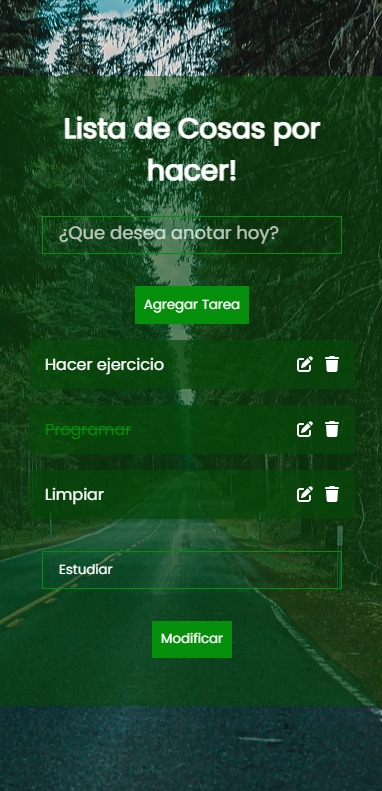

### Pablo Paez 💻
# To Do List - Lista de tareas para completar!
Aplicacion para anotar tareas para realizar y marcar como completadas clickeando en el texto de la tarea! - Pablo Paez

# Contacto

Pablo Paez - Desarrollador Web - pablopaez2307@gmail.com

[![LinkedIn][linkedin-shield]][linkedin-url]


# Demo del proyecto:
<br/>


# Version Mobile📱

<div align="center">

  <a href="https://github.com/Pepe2307/ToDoList_React">
    
  </a>
</div>

# Tecnologias/Software Utilizado en la creacion del proyecto:

Este proyecto utiliza como herramienta principal: 
[![React][React.js]][React-url]
<br/>
Y en adicion se utilizaron conocimientos en:

    -HTML
    -CSS
    -JAVASCRIPT
    -GIT KRAKEN

# Instalacion

### Requisitos previos

Se recomienda tener la ultima version de npm para evitar errores:

  ```sh
  npm install npm@latest -g
  ```
* Gitbash/GitKraken o su software de preferencia y Visual Studio Code

### Clonar repositorio


1. Clonar el repositorio
   ```sh
   git clone https://github.com/Pepe2307/WebTrabajo
   ```
   
2. Instalar paquetes NPM
Abrir dentro de Visual Studio Code la carpeta del repositorio clonado > darle click derecho a la misma > Abrir en terminal
   ```sh
   npm install
   ```
   
3. Inicializar proyecto

   ```js
   npm start
   ```


Que disfrutes tu viaje!


[linkedin-shield]: https://img.shields.io/badge/-LinkedIn-black.svg?style=for-the-badge&logo=linkedin&colorB=555
[linkedin-url]: https://www.linkedin.com/in/pablo-paez-t/
[React.js]: https://img.shields.io/badge/React-20232A?style=for-the-badge&logo=react&logoColor=61DAFB
[React-url]: https://reactjs.org/
